# Evaluación Práctica Final — Seguridad Informática
### Unidad IV: Monitoreo de Seguridad, SIEM e Inteligencia Artificial

| Campo | Detalle |
|---|---|
| **Alumno** | Jamil Antony Zuñiga Apaza |
| **Repositorio** | https://github.com/JamilAntony/examen-practico-zuniga |
| **Fecha** | 01 de julio de 2026 |
| **Curso** | Seguridad Informática — Ciclo IX |
| **Entorno** | Ubuntu Server 22.04 LTS en VirtualBox |

---

## Lab 1 — Análisis Forense de Logs

- 253 intentos fallidos SSH detectados
- 2 IPs con alerta de fuerza bruta: `45.33.32.156` (120) y `193.32.162.55` (58)
- 4 intentos de SQL Injection detectados desde `193.32.162.55`

### Ejecución del script SSH
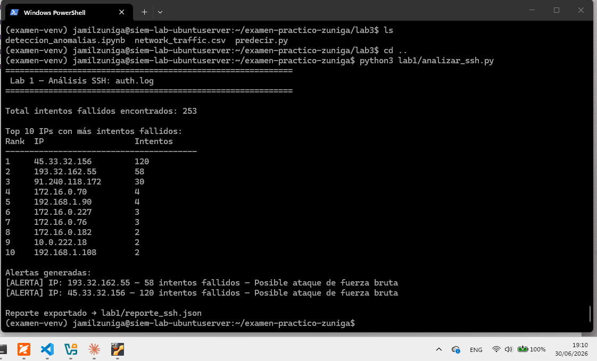

### Reporte JSON generado
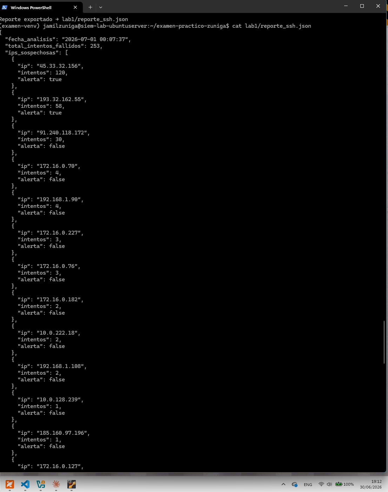

### Análisis web — ejecución
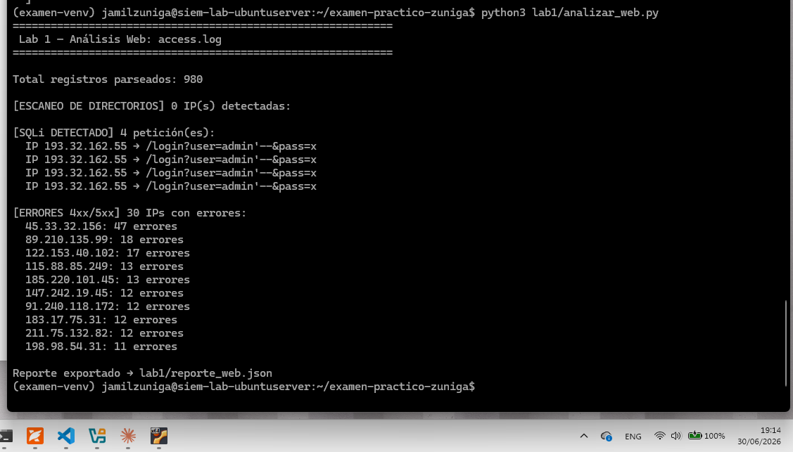

### Análisis web — reporte JSON
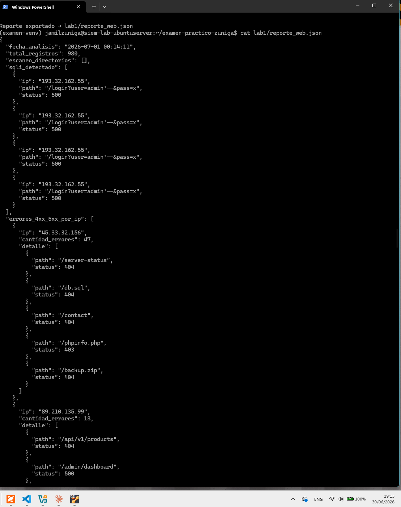

### Gráfica: Top 10 IPs con más intentos SSH
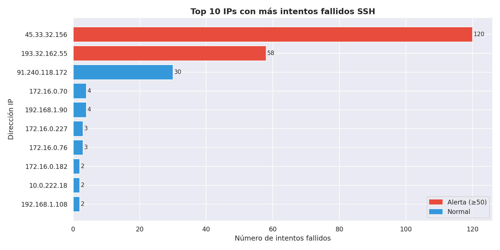

### Gráfica: Timeline HTTP
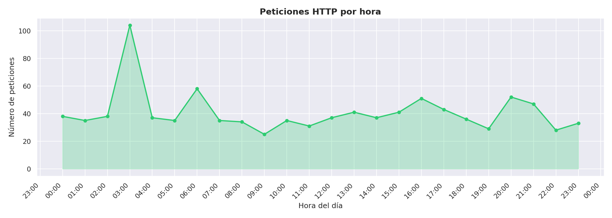

### Gráfica: Heatmap HTTP
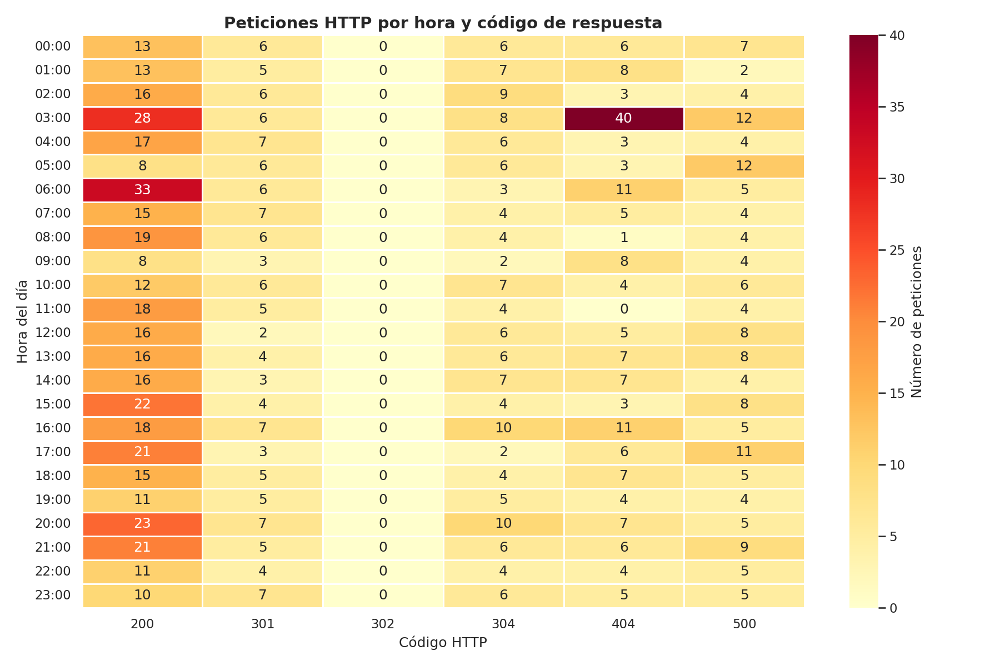

---

## Lab 2 — Reglas de Correlación Wazuh

- Regla 100001: brute force SSH (10 intentos en 60s, nivel 10)
- Regla 100011: exfiltración de datos (login nocturno + >500MB, nivel 14 CRÍTICO)
- MITRE ATT&CK: T1048

### Wazuh activo
.png)

### Alerta disparada en logs
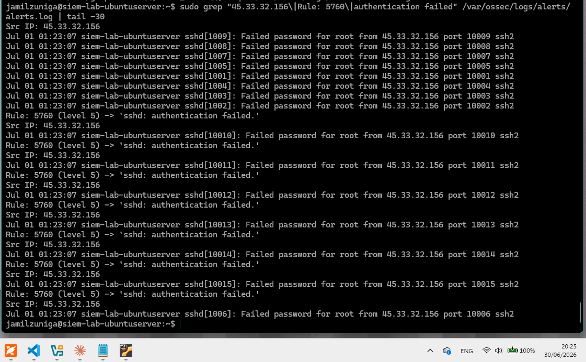

---

## Lab 3 — Detección de Anomalías con ML

- Isolation Forest: `contamination=0.05`, `n_estimators=100`, `random_state=42`
- Features: `ratio_bytes`, `bytes_por_segundo` + 5 features originales
- Modelo exportado: `modelo_anomalias.pkl`

### EDA — Distribución de features
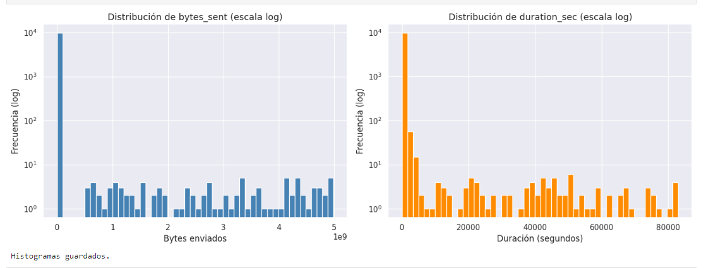

### Matriz de confusión
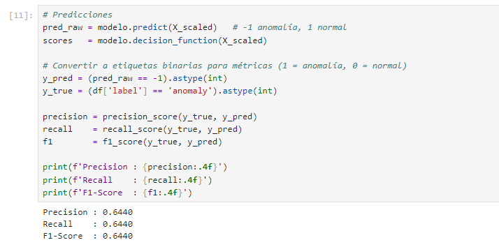

### Curva umbral vs F1-Score
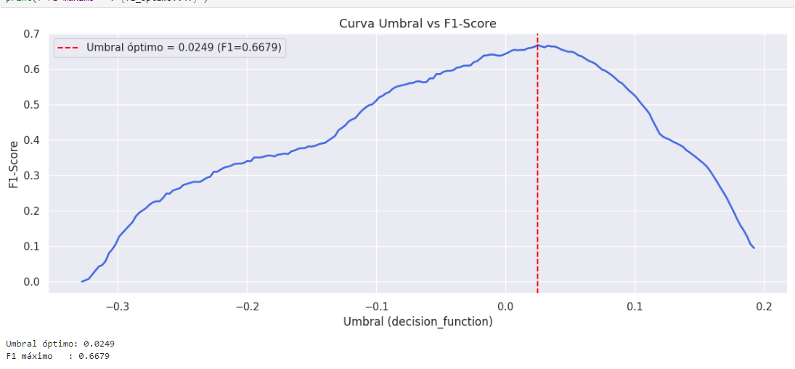

### Modelo exportado
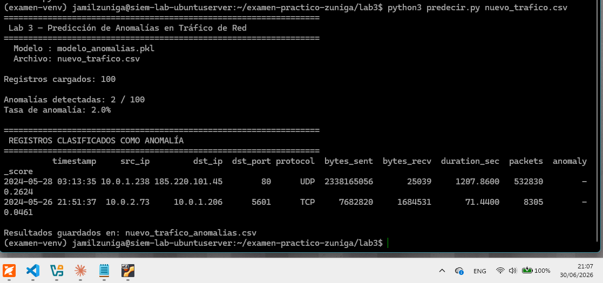

---

## Lab 4 — Dashboard SOC

- 4 visualizaciones: severidad, top IPs, timeline, pie de tipos
- Herramienta: Python/Matplotlib
- Regla de alerta: `count > 5` eventos en 5 minutos, `level >= 10`

### Dashboard integrado
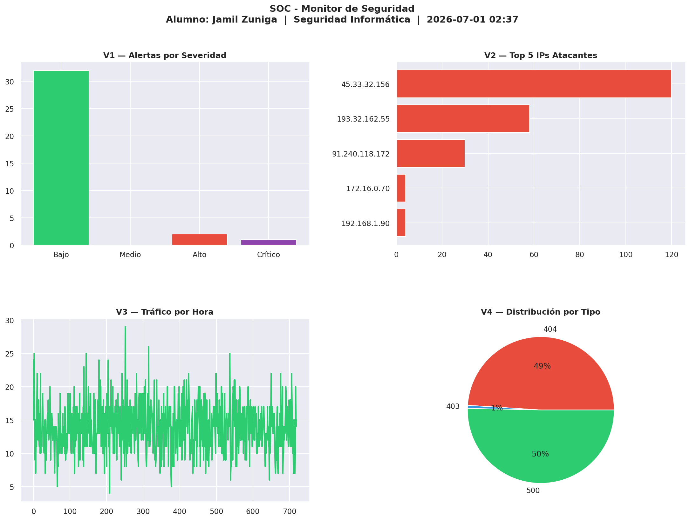

---

## Conclusiones

- **Lab 1**: Análisis forense identificó la IP `45.33.32.156` (Shodan scanner) con 120 intentos SSH y `193.32.162.55` con inyecciones SQL.
- **Lab 2**: Reglas Wazuh implementadas para correlación en tiempo real con nivel crítico 14.
- **Lab 3**: Isolation Forest detectó anomalías de red sin datos etiquetados para entrenamiento.
- **Lab 4**: Dashboard SOC unifica todos los hallazgos en visualizaciones operacionales.
